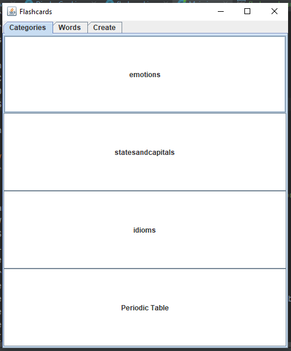
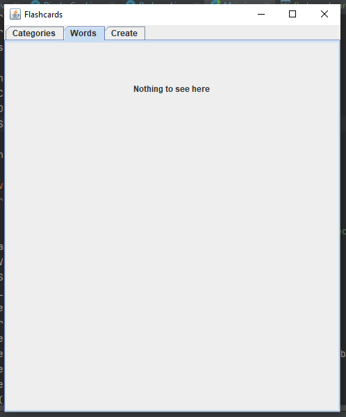
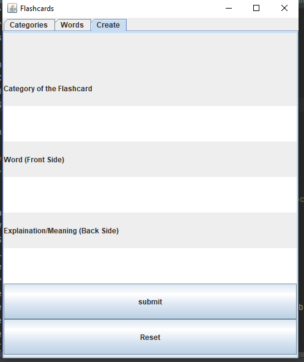
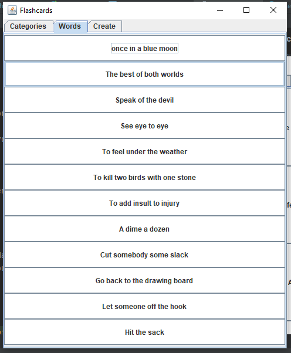
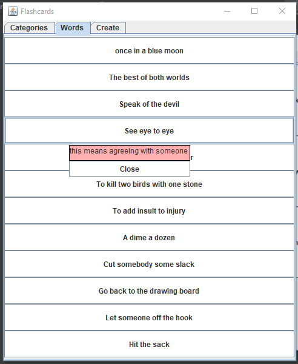
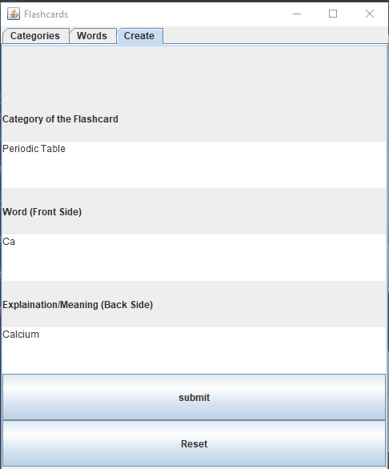
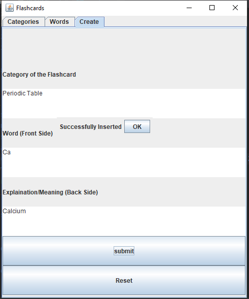
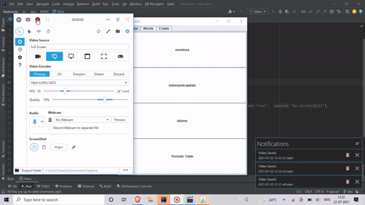

# Flashcards
## About the project
This project creates flashcards which is a way to memorize information efficiently. It is written in Java, uses MySql as the database. Later on in this file you will find details about every aspect of the project.
## Working
The program initially connects to the database and it displays all the categories of flashcards that exist.
The displayed flashcards when clicked shows the other side of the card as a pop up. 
### Insert new set of Flashcards
IIf the user wishes to insert a new set of Flashcards, the user can navigate to the insert section and fill out the form. 

## Concepts
* JDBC concepts - eg: connection, excecution and update statements etc
* Java Swing and AWT.
* Inheritance used to customize JPanel for flashcards.
* Abstraction.
* Implementing the ActionListener Interface.
* Parametirized Constructors
* Use of 'this' keyword
* Exception Handling using the try catch block
* Function overriding
* Access Modifiers - access control mechanisms
* Importing and use of different packages.
* PopUp and popup factory.
* Suppilier - Functional Interface
* Getter Setter functions
* Scope and Lifetime of variables, declaration of different data types of Instance Variables
* Dynamic Arrays - ArrayList

## How to use
#### Requirements
* IntelliJ Community Edition 1.2
* MySQL Version 8 above
#### Clone the repo 
1. Open Git Bash, change the current directory to the one you want the cloned directory.
2. Copy the URL of the repo.
3. Type 'git clone' and then paste the URL you copied.
4. Press enter to create your local clone.

#### MySQL
1. After installing MySQL, open MySQL Workbench and import the SQL file that should be available in the directory you cloned in.
2. Run the [sql script](database/flash_card_cards.sql).

#### IntelliJ
1. Open the project on IntelliJ.
2. Change the username and password in the [Main.java](src/app/MAIN/Main.java) file accordingly.
3. Now the program should run properly on your system.

## Screenshots and Output

### Screenshots
##### Categories

##### Flashcards section when nothing is clicked

##### Initial create screen

##### When the category -idioms is chosen

##### When a Flashcard is clicked on

##### Insert a new flashcard

##### Successful insertion

### Output

